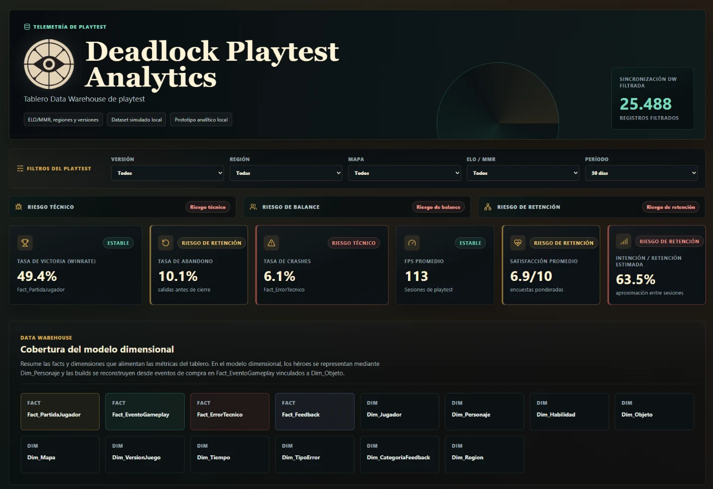
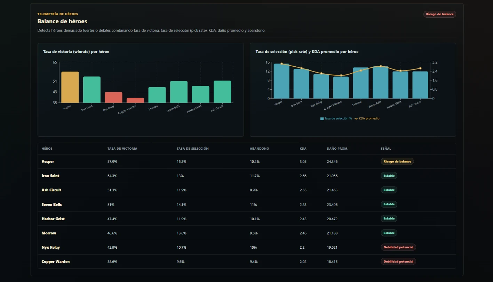
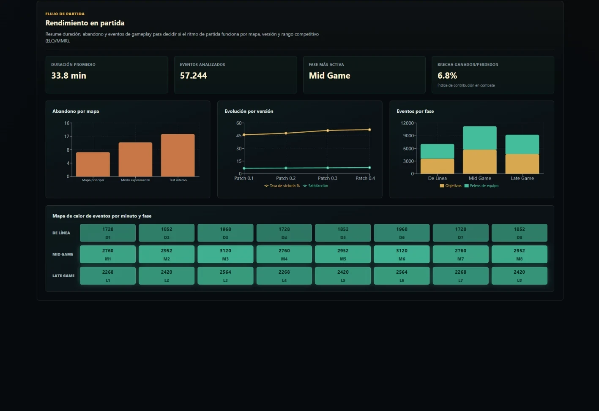
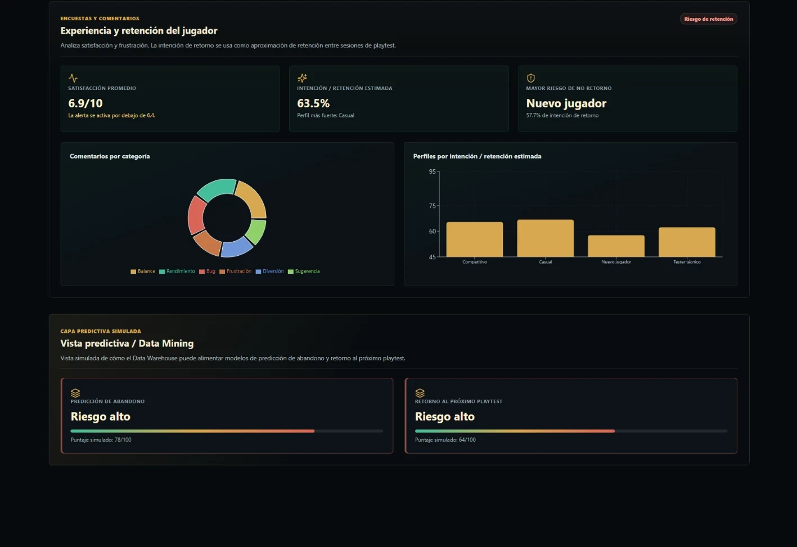

# Deadlock Playtest Analytics

Local analytics dashboard prototype for exploring simulated competitive playtest data.

The project demonstrates how a Data Warehouse-style model can support indicators related to game balance, technical performance, player experience, retention, and predictive analysis.

## Objective

Provide an analytical view of simulated playtest metrics related to:

- hero balance
- match performance
- technical stability
- player feedback
- retention
- abandonment and return probability

## Tech Stack

- React
- TypeScript
- Vite
- Recharts
- Custom CSS
- Local simulated datasets

## Simulated Data

The project does not use real player data.

Local datasets simulate:

- matches
- gameplay events
- technical errors
- player feedback
- game versions
- regions
- maps
- heroes
- player profiles

The data is not official Valve or Deadlock information.

The project does not connect to a backend, external service, or external API.

## Analytical Model

### Facts

- `Fact_PartidaJugador`
- `Fact_EventoGameplay`
- `Fact_ErrorTecnico`
- `Fact_Feedback`

### Dimensions

- `Dim_Jugador`
- `Dim_Personaje`
- `Dim_Habilidad`
- `Dim_Objeto`
- `Dim_Mapa`
- `Dim_VersionJuego`
- `Dim_Tiempo`
- `Dim_TipoError`
- `Dim_CategoriaFeedback`
- `Dim_Region`

Heroes are represented through `Dim_Personaje`.

Item builds are reconstructed from purchase events stored in `Fact_EventoGameplay` and linked to `Dim_Objeto`.

## Features

- Interactive filters by version, region, map, competitive range, and period
- Win-rate and abandonment KPIs
- Winner/loser performance gap
- Crash-rate, FPS, and latency analysis
- Player satisfaction and estimated retention metrics
- Balance, technical, and retention risk indicators
- Hero balance rankings and charts
- Match-duration and gameplay-phase analysis
- Feedback distribution
- Simulated predictive views for abandonment and return probability

## Screenshots

<table>
  <tr>
    <td align="center"><strong>Dashboard Overview</strong></td>
    <td align="center"><strong>Hero Balance</strong></td>
  </tr>
  <tr>
    <td align="center"><a href="docs/screenshots/overview.webp"></a></td>
    <td align="center"><a href="docs/screenshots/hero-balance.webp"></a></td>
  </tr>
  <tr>
    <td align="center"><strong>Match Performance</strong></td>
    <td align="center"><strong>Player Insights</strong></td>
  </tr>
  <tr>
    <td align="center"><a href="docs/screenshots/match-performance.webp"></a></td>
    <td align="center"><a href="docs/screenshots/player-insights.webp"></a></td>
  </tr>
</table>

Screenshots show locally simulated playtest data, not official game telemetry.

## Running Locally

```bash
npm install
npm run dev
```

Vite will display the local development URL, usually:

```text
http://localhost:5173
```

## Build

```bash
npm run build
```

The production bundle is generated in `dist/`.

## Scope

This repository is a local analytics prototype built around simulated playtest data.

It is not an official Valve or Deadlock tool and does not represent official game data.
